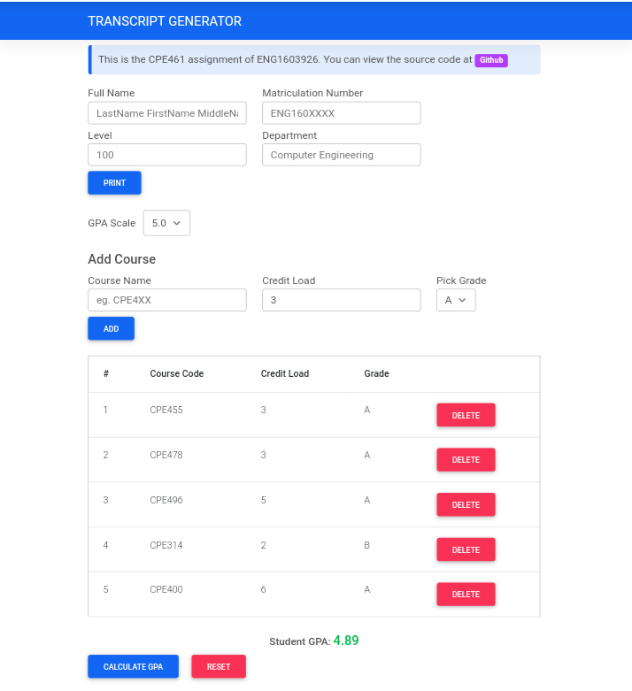

Overview
========
This folder contains two html files, transcript.html and gpa_calculator.html. The gpa_calculator contains only code to calculate GPA while the transcript extends it with functionality to print out a pdf transcript.
The code has been tested on Chrome For Android v87.

Technologies Used
=================
* HTML/CSS/**Javascript**
* Material-Design Bootstrap (mdb.min.js,mdb.min.css) for making the site presentable so I could focus on core functionality. An overview of bootstrap features can be gotten at [Bootstrap guide](https://getbootstrap.com/docs/4.0/getting-started/) but is not necessary to understand the code.

Screenshot
==========

References
==========
* How To Convert Your GPA To A 4.0 Scale [https://pages.collegeboard.org/how-to-convert-gpa-4.0-scale](https://pages.collegeboard.org/how-to-convert-gpa-4.0-scale)
* University of Benin Prospectus